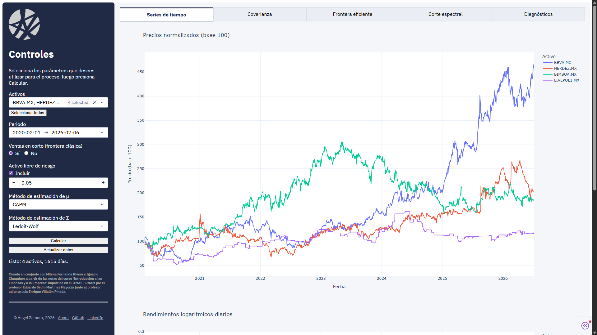

# BMV Portfolio Optimization

Interfaz interactiva (Plotly Dash) para visualizar el comportamiento de activos de la
Bolsa Mexicana de Valores y optimizar portafolios con dos enfoques complementarios:

- **Frontera eficiente clásica** (Markowitz): GMV, portafolio de tangencia y línea de
  mercado de capitales (CML), con o sin ventas en corto.
- **Corte espectral (Modelo 6)**: aproximación de la varianza vía descomposición
  espectral de la matriz de covarianza, útil cuando el número de activos es grande
  frente al histórico disponible.

Los datos se obtienen de Yahoo Finance (`yfinance`) y se cachean localmente en Parquet.



## Estructura del proyecto

```
BMV_portfolio_optimization/
├── config/
│   └── config.json        # tickers, benchmark, umbrales (editable)
├── data/                  # parquet cacheados (versionados: precios_crudos, benchmark)
├── notebooks/             # notebooks de exploración y validación
├── src/
│   ├── datos.py           # extracción, limpieza e imputación
│   ├── estimacion.py       # estimadores de $\mu$ y $\Sigma$
│   ├── optimizacion.py     # frontera clásica (GMV, tangencia, CML)
│   ├── espectral.py         # Modelo 6 (corte espectral)
│   └── graficas.py          # figuras plotly reutilizables
├── tests/                  # suite pytest
├── app.py                  # interfaz Dash
├── requirements.txt
└── Procfile                 # arranque en producción (gunicorn)
```

## Instalación local

1. Clonar el repositorio y crear un entorno virtual:

   ```bash
   python -m venv venv
   ```

2. Activar el entorno e instalar dependencias:

   ```powershell
   # Windows (PowerShell)
   venv\Scripts\Activate.ps1
   pip install -r requirements.txt
   ```

3. Los tickers, el benchmark y los umbrales de limpieza/espectral se configuran en
   `config/config.json` — ya viene con una lista de referencia de emisoras de la BMV.

## Datos

El repositorio incluye un cache Parquet (`data/precios_crudos.parquet`,
`data/benchmark.parquet`) ya poblado, así que la app arranca sin necesidad de
descargar nada de Yahoo Finance. Para refrescar los datos con las cotizaciones más
recientes, usa el botón **"Actualizar datos"** dentro de la interfaz (fuerza una
nueva descarga y limpia la caché de cálculos en memoria).

## Correr la app localmente

```powershell
venv\Scripts\python.exe app.py
```

Abre `http://127.0.0.1:8050` en el navegador. Selecciona activos, periodo y
métodos de estimación en la barra lateral, presiona **Calcular**, y navega entre las
pestañas (Series de tiempo, Covarianza, Frontera eficiente, Corte espectral,
Diagnósticos).

## Pruebas

Suite de pytest sobre las funciones críticas de `src/` (imputación, estimadores de
$\mu$ y $\Sigma$, optimización clásica y espectral):

```powershell
venv\Scripts\python.exe -m pytest
```

## Notebooks de validación

Cada etapa de migración del notebook original a `src/` se valida en un notebook
dedicado dentro de `notebooks/`:

- `01_validacion_datos.ipynb` — extracción, limpieza e imputación.
- `02_validacion_estimacion.ipynb` — estimadores de $\mu$ y $\Sigma$.
- `03_validacion_frontera.ipynb` — frontera clásica vs. PyPortfolioOpt.
- `04_validacion_espectral.ipynb` — convergencia y cotas del Modelo 6.
- `05_validacion_integral.ipynb` — comparación end-to-end contra el notebook
  original (`Extracción datos.ipynb`).

## Despliegue (Render / Railway)

La app expone el objeto Flask subyacente como `server` en `app.py`, y el `Procfile`
ya apunta a él con `gunicorn`:

```
web: gunicorn app:server
```

**Nota:** Yahoo Finance puede limitar o bloquear solicitudes desde IPs de
datacenter con más agresividad que desde una IP residencial. Si "Actualizar datos"
falla en producción, es probable que sea por esto — no es necesariamente un bug.

---

> Creado en conjunto con Milena Fernanda Rivera e Ignacio Chuquiure a partir de las notas del curso 'Introducción a las Finanzas y a la Empresa' impartido en el IIMAS - UNAM por el profesor Eduardo Selim Martínez Mayorga junto al profesor adjunto Luis Enrique Villalón Pineda.
